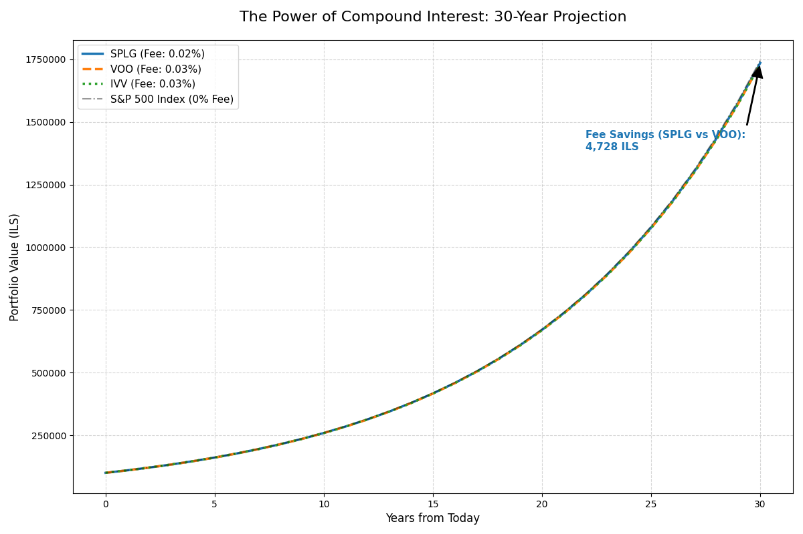

# 📈 S&P 500 ETF Analysis: The 0.01% Difference
### ניתוח כדאיות כלכלית והשפעת דמי ניהול על קרנות מחקות מדד

## 🎯 מטרת הפרויקט
בפרויקט זה ביצעתי השוואה בין שלוש הקרנות המרכזיות העוקבות אחר מדד ה-S&P 500: **SPLG, VOO, ו-IVV**. המטרה היא להדגים כיצד הבדלים מזעריים בדמי הניהול מצטברים לסכומים משמעותיים לאורך זמן בזכות אפקט הריבית דריבית.

## 🛠️ טכנולוגיות
* **Python**: עיבוד נתונים וחישובים.
* **SQL (SQLite)**: ניהול בסיס נתונים מקומי ואחסון היסטוריית מחירים.
* **Matplotlib**: ויזואליזציה והשוואת ביצועים גרפית.
* **yfinance API**: משיכת נתוני שוק בזמן אמת.

## 🚀 שלבי העבודה
1. **Extraction**: משיכת נתוני אמת של 15 שנה אחרונות.
2. **Storage**: הקמת בסיס נתונים SQL ושמירת הנתונים בטבלה.
3. **Analysis**: מידול השפעת דמי הניהול על השקעה לטווח ארוך (30 שנה).
4. **Visualization**: יצירת גרף השוואתי המראה את יתרון ה-SPLG.

## 💡 מסקנות
חיסכון של 0.01% בעמלות הניהול (מעבר מ-VOO ל-SPLG) מתרגם לגידול משמעותי בתיק ההשקעות לאורך 30 שנה.
בסימולציה של 30 שנה על סכום של 100,000 ש"ח, נמצא כי המעבר ל-SPLG חוסך למשקיע 4,741 ש"ח בעמלות וריבית דריבית אבודה, לעומת השקעה בקרנות המקבילות VOO או IVV.

